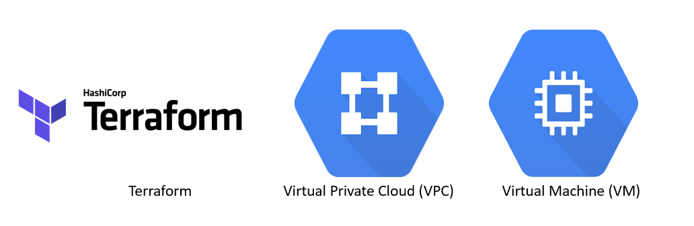

# GCP_instance_module


<!---[![Contributors][contributors-shield]][contributors-url]
[![Forks][forks-shield]][forks-url]
[![Stargazers][stars-shield]][stars-url]
[![Issues]][issues-url]
[![MIT License]][license-url]-->

<!-- PROJECT LOGO -->
<br />
<p align="center">
  <a href="https://github.com/firasouerghi/GCP_instance_module">
    
  </a>

  <h3 align="center">Advanced google compute instance creation with terraform</h3>

  <p align="center">
    project_description
    <br />
    <a href="https://github.com/firasouerghi/GCP_instance_module"><strong>Explore the docs »</strong></a>
    <br />
    <br />
    <a href="https://github.com/firasouerghi/GCP_instance_module">View Demo</a>
    ·
    <a href="https://github.com/firasouerghi/GCP_instance_module/issues">Report Bug</a>
    ·
    <a href="https://github.com/firasouerghi/GCP_instance_module/issues">Request Feature</a>
  </p>
</p>


<!-- TABLE OF CONTENTS -->
<details open="open">
  <summary><h2 style="display: inline-block">Table of Contents</h2></summary>
  <ol>
    <li>
      <a href="#about-the-project">About The Project</a>
      <ul>
        <li><a href="#project-structure">Project Structure</a></li>
      </ul>
    </li>
    <li>
      <a href="#getting-started">Getting Started</a>
      <ul>
        <li><a href="#prerequisites">Prerequisites</a></li>
        <li><a href="#usage">Usage</a></li>
      </ul>
    </li>
    <li><a href="#roadmap">Roadmap</a></li>
    <li><a href="#contributing">Contributing</a></li>
    <li><a href="#license">License</a></li>
    <li><a href="#contact">Contact</a></li>
  </ol>
</details>


<!-- ABOUT THE PROJECT -->
## About The Project

[![Product Name Screen Shot][product-screenshot]](https://example.com)

**This project contains all the necessary steps and files to set up and provision an advanced GCP compute instance hosting an nginx server**


### Project structure

* [version.tf](https://github.com/firasouerghi/GCP_instance_module/blob/main/version.tf)

   Defines the required version of Terraform and google provider 

* [provider.tf](https://github.com/firasouerghi/GCP_instance_module/blob/main/provider.tf)
* [main.tf](https://github.com/firasouerghi/GCP_instance_module/blob/main/main.tf)
* [firewall.tf](https://github.com/firasouerghi/GCP_instance_module/blob/main/firewall.tf)
* [output.tf](https://github.com/firasouerghi/GCP_instance_module/blob/main/output.tf)
* [variables.tf](https://github.com/firasouerghi/GCP_instance_module/blob/main/variables.tf)
* [terraform.tfvars](https://github.com/firasouerghi/GCP_instance_module/blob/main/terraform.tfvars)


<!-- GETTING STARTED -->
## Getting Started

To get a local copy up and running follow these simple steps.

### Prerequisites

* Terraform installation
  ```sh
    $ curl -fsSL https://apt.releases.hashicorp.com/gpg | sudo apt-key add -
    $ sudo apt-add-repository "deb [arch=amd64] https://apt.releases.hashicorp.com $(lsb_release -cs) main"
    $ sudo apt-get update && sudo apt-get install terraform
  ```


<!-- USAGE EXAMPLES -->
## Usage

1. Clone the repo
   ```sh
   git clone https://github.com/firasouerghi/GCP_instance_module.git
   ```
2. Start the infrastructure provisioning
   ```sh
   $ terraform init
   $ terraform validate
   $ terraform plan
   $ terraform apply
   ```
3. Destroy the created infrastructure
   ```sh
      $ terraform destroy
   ```


<!-- ROADMAP -->
## Roadmap

See the [open issues](https://github.com/firasouerghi/GCP_instance_module/issues) for a list of proposed features (and known issues).


<!-- CONTRIBUTING -->
## Contributing

Contributions are what make the open source community such an amazing place to be learn, inspire, and create. Any contributions you make are **greatly appreciated**.

1. Fork the Project
2. Create your Feature Branch (`git checkout -b feature/Feature`)
3. Commit your Changes (`git commit -m 'Add some Feature'`)
4. Push to the Branch (`git push origin feature/Feature`)
5. Open a Pull Request


<!-- LICENSE -->
## License

Distributed under the Apache License 2.0. See `LICENSE` for more information.


<!-- CONTACT -->
## Contact
[![LinkedIn][linkedin-shield]][linkedin-url]

email: [Firas Ouerghi](mailto:ouerghifir@gmail.com) 


<!-- ACKNOWLEDGEMENTS 
## Acknowledgements

* []()-->


<!-- MARKDOWN LINKS & IMAGES -->
<!-- https://www.markdownguide.org/basic-syntax/#reference-style-links -->
[contributors-shield]: https://img.shields.io/github/contributors/github_username/repo.svg?style=for-the-badge
[contributors-url]: https://github.com/firasouerghi/
[forks-shield]: https://img.shields.io/github/forks/github_username/repo.svg?style=for-the-badge
[forks-url]: https://github.com/github_username/repo/network/members
[stars-shield]: https://img.shields.io/github/stars/github_username/repo.svg?style=for-the-badge
[stars-url]: https://github.com/github_username/repo/stargazers
[issues-shield]: https://img.shields.io/github/issues/github_username/repo.svg?style=for-the-badge
[license-shield]: https://img.shields.io/github/license/github_username/repo.svg?style=for-the-badge
[linkedin-shield]: https://img.shields.io/badge/-LinkedIn-black.svg?style=for-the-badge&logo=linkedin&colorB=555


[issues-url]: https://github.com/firasouerghi/GCP_instance_module/issues
[license-url]: https://github.com/firasouerghi/GCP_instance_module/blob/main/LICENSE
[linkedin-url]: https://linkedin.com/in/firas-ouerghi/
